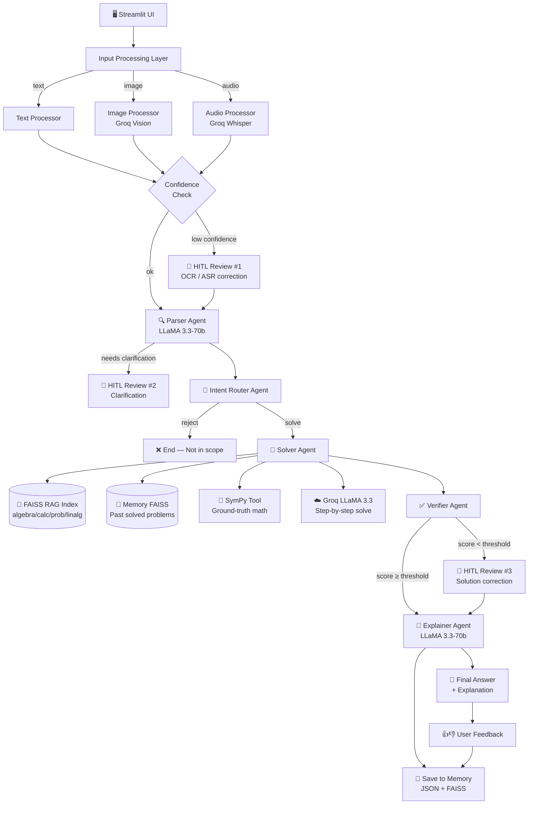

# Math Mentor — System Architecture

## Component Summary

| Component | File | Role |
|-----------|------|------|
| Streamlit UI | `app.py` | Full UI, HITL panels, session state |
| Text Processor | `input_processing/text_processor.py` | Passthrough with confidence=1.0 |
| Image Processor | `input_processing/image_processor.py` | Groq Vision OCR |
| Audio Processor | `input_processing/audio_processor.py` | Groq Whisper ASR |
| Parser Agent | `agents/parser_agent.py` | Extracts problem structure → JSON |
| Intent Router | `agents/intent_router_agent.py` | Routes: solve/hitl/clarify/reject |
| Solver Agent | `agents/solver_agent.py` | RAG + SymPy + LLM solving |
| Verifier Agent | `agents/verifier_agent.py` | Critiques solution, assigns score |
| Explainer Agent | `agents/explainer_agent.py` | Step-by-step student explanation |
| HITL Manager | `hitl/hitl_manager.py` | approve/edit/reject state transitions |
| Memory Store | `memory/memory_store.py` | JSON persistence of all problems |
| Memory Retriever | `memory/memory_retriever.py` | FAISS similarity search over past problems |
| SymPy Tool | `tools/sympy_tool.py` | Symbolic math ground truth |
| RAG Vector Store | `rag/` | FAISS index over knowledge base |
| LangGraph Pipeline | `agents/graph.py` | Orchestrates all 5 nodes |